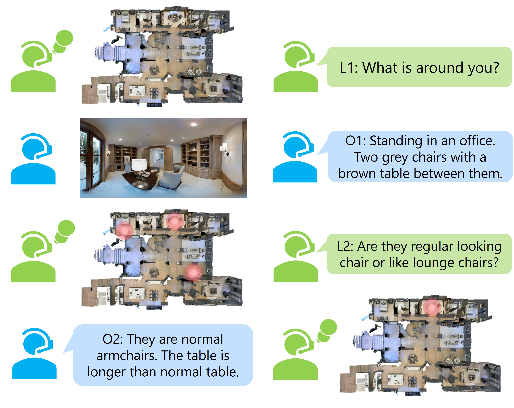

# DiaLoc: An Iterative Approach to Embodied Dialog Localization

This is the offical repository for the iterative dialog localization work described in [DiaLoc: An Iterative Approach to Embodied Dialog Localization]
https://arxiv.org/abs/2403.06846

<p align="center">
  
</p>


# Prepare Data: Where Are You? (WAY) Dataset

The dataset WAY could be found following the project:
https://github.com/meera1hahn/Graph_LED

# Setup
```
pip install -r requirements.txt
```
# Training Models

## One-shot Version

```
bash run_LED.sh
```
Please modify the path to point to WAY data folder. 

## Multi-shot Version

```
bash run_SEQ.sh
```
